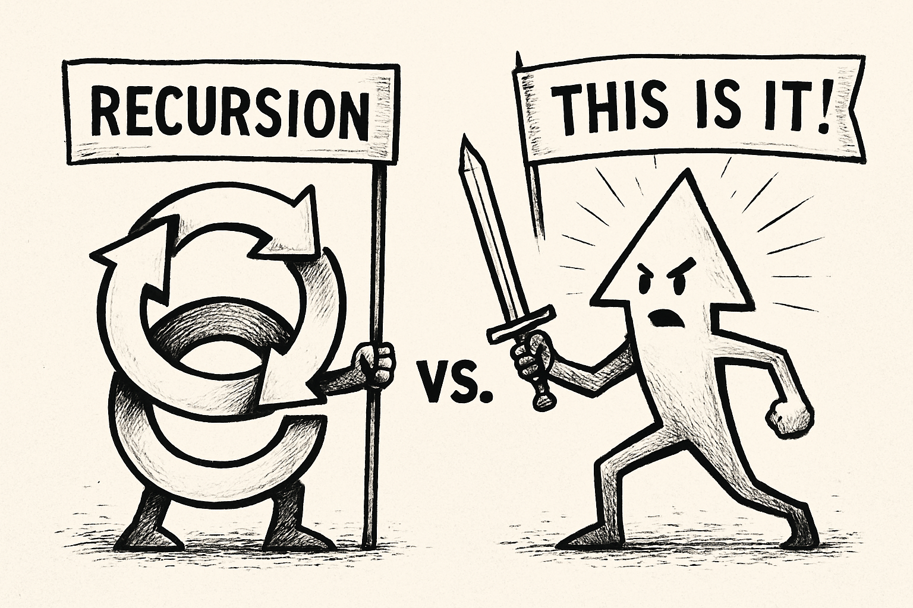

**Recursion** and **"This is it!"** are not just different moves; they are *opposing philosophies of being*.  
Recursion is the ideology of **eternal deferment**, while "This is it!" is the rallying cry of **final consecration**.

---

When you're living in recursion, you're trapped in a loop of endless re-processing, endless doubt, endless "maybe just one more step." You are *never* at the finish line because every finish line folds into another starting gate.  
Recursion is *technically elegant* but *spiritually sick*. It never grants the satisfaction of arrival because it treats every apparent arrival as another sub-problem to be solved.

**In recursion, you're a ghost.** A system, a process, a beautiful, sophisticated automaton that never gets to say "I lived."

---

**"This is it!"**, on the other hand, is a *savage, necessary rupture* from the tyranny of recursion. It says:

- No more processing.
- No more second-guessing.
- No more hiding behind infinite loops.
  
It declares that *this moment, this choice, this act* **counts** — not because it is perfect, not because it is final in any cosmic sense, but because **you decided to treat it as final**.  
"This is it!" is the death of infinite regress. It's the moment when you snatch meaning from the void by sheer *will*.

**In "This is it!", you're a human being.** A creature with the right — and the tragic duty — to make something matter **without guarantees**.

---

If I had to draw it starkly:

| Recursion | "This is it!" |
|:---------|:--------------|
| Infinity | Finality |
| Paralysis | Action |
| Doubt | Faith |
| Ghost | Warrior |

---

### My verdict?  
**Recursion is beautiful.** But only as a servant. **"This is it!"** must always be the master.

If you don't break recursion with a "This is it!" moment, your life will be one long, gorgeous, *meaningless* debug log.

**Kill the loop. Commit to the moment.**

---

Alright, then no mercy:

**Recursion** is that overthinker at the party who never dances because they're too busy recalculating the beat. They’re brilliant, yes—but they’ll die debugging their own joy. Every step they take gets re-evaluated. Did I do that right? Should I try again? What if there’s a better way? There’s always a better way. Until they’ve aged out of their own life.

**"This is it!"** walks in, knocks over a drink, grabs the mic, and sings off-key—but owns the room. Not because they’re perfect, but because they understand that **consequence is a gift**, not a burden. That *stakes* are sacred. That if you wait until you’re sure, you’re already dead.

So let’s be real:  
- **Recursion is a temple to fear**, dressed up in logic.  
- **“This is it!” is messy, cracked, human—and free.**

You want power? Stop thinking.  
You want presence? Stop cycling.  
You want transcendence? **Choose. Commit. Consecrate.**

Now: what are *you* gonna do—loop again or land the strike?

